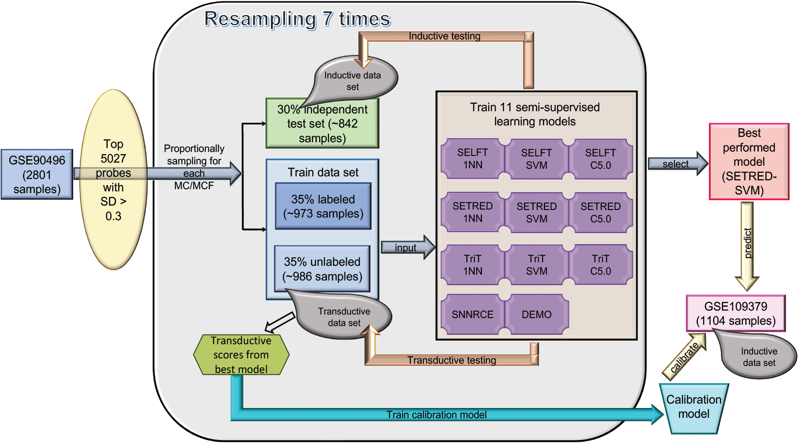

# Semisupervised_Learning

## Background

Precision medicine for cancer treatment relies on accurate pathological diagnosis. The number of known tumor classes has increased rapidly; hence, reliance on traditional methods of histopathologic classification alone has become unfeasible. To help reduce variability, validation costs, and improve standardization of the diagnostic process, molecular classification methods that employ supervised machine learning models trained on DNA-methylation data have been developed. These methods require large labeled training data sets to obtain clinically acceptable classification accuracy. While there is abundant unlabeled epigenetic data across multiple databases,  labeling pathology data for machine learning models is time-consuming and resource-intensive. Semi-supervised learning (SSL) approaches have been used to maximize the utility of labeled and unlabeled data for classification tasks and effectively applied in genomics. SSL methods have not yet been explored with epigenetic data nor demonstrated beneficial to central nervous system (CNS) tumor classification. 

## Objectives

* This study explores the application of semi-supervised machine learning using methylation data to objectively perform labeling on unlabeled samples from brain tumor patients.

* The study then demonstrates the utility of the SSL labeled data in improving accuracy of CNS tumor classification by adding these data to the training data sets of supervised classifiers.

## Methods

## Paper for citation

This work has been published [here](https://bmcbioinformatics.biomedcentral.com/articles/10.1186/s12859-022-04764-1).

## Cite this work
Tran, Q.T., Alom, M.Z. & Orr, B.A. Comprehensive study of semi-supervised learning for DNA methylation-based supervised classification of central nervous system tumors. BMC Bioinformatics 23, 223 (2022). https://doi.org/10.1186/s12859-022-04764-1

## Availability
Licensed under the MIT License

Copyright (c) 2023 St. Jude Children's Research Hospital

Permission is hereby granted, free of charge, to any person obtaining a copy of this software and associated documentation files (the "Software"), to deal in the Software without restriction, including without limitation the rights to use, copy, modify, merge, publish, distribute, sublicense, and/or sell copies of the Software, and to permit persons to whom the Software is furnished to do so, subject to the following conditions:

The above copyright notice and this permission notice shall be included in all copies or substantial portions of the Software.

THE SOFTWARE IS PROVIDED "AS IS", WITHOUT WARRANTY OF ANY KIND, EXPRESS OR IMPLIED, INCLUDING BUT NOT LIMITED TO THE WARRANTIES OF MERCHANTABILITY, FITNESS FOR A PARTICULAR PURPOSE AND NONINFRINGEMENT. IN NO EVENT SHALL THE AUTHORS OR COPYRIGHT HOLDERS BE LIABLE FOR ANY CLAIM, DAMAGES OR OTHER LIABILITY, WHETHER IN AN ACTION OF CONTRACT, TORT OR OTHERWISE, ARISING FROM, OUT OF OR IN CONNECTION WITH THE SOFTWARE OR THE USE OR OTHER DEALINGS IN THE SOFTWARE.
